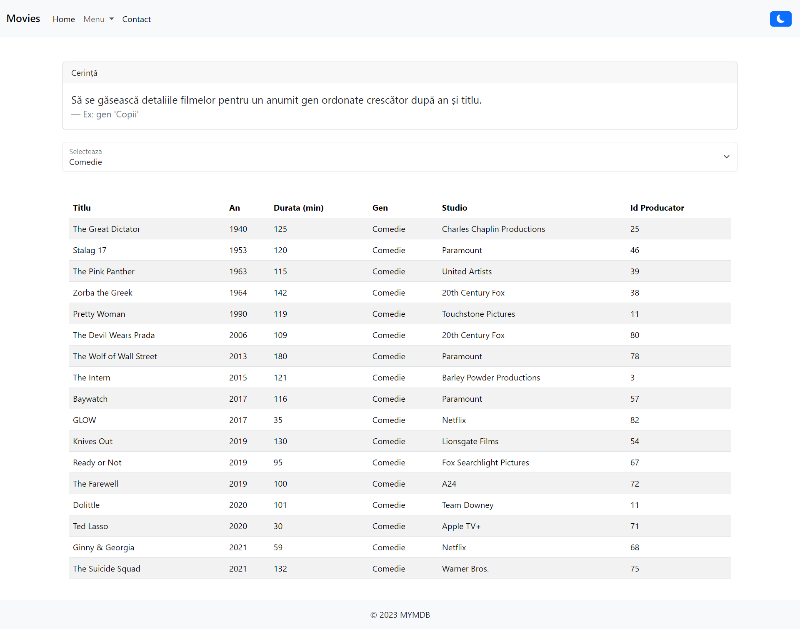
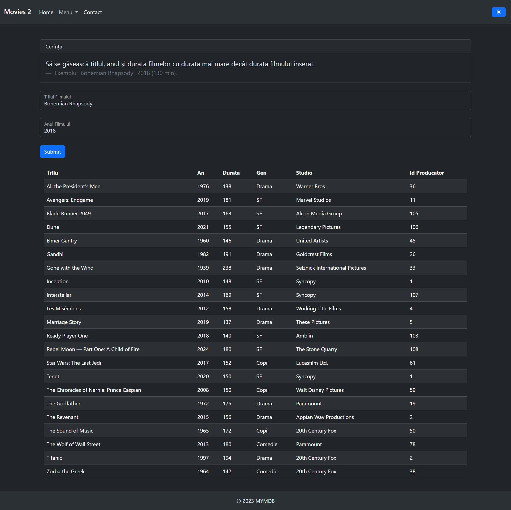
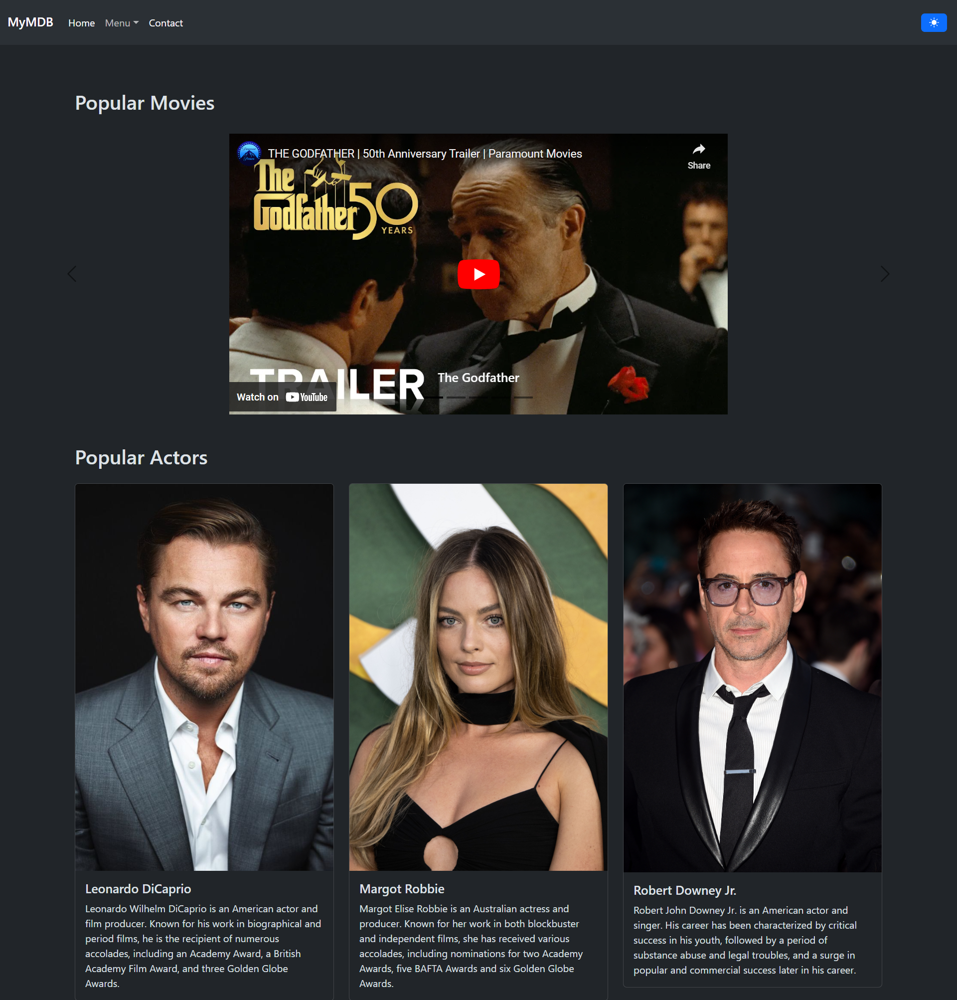
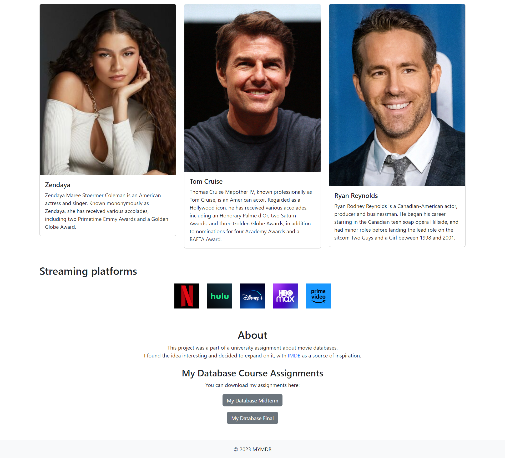

# MyMDB WebSite

# Project Description

This project was a part of a university assignment about movie databases. 
I found the idea interesting and decided to expand on it, with IMDB as a source of inspiration.

## Features

- **Dynamic Movie Database:** Utilizing Java Spring Boot to interact with a MySQL database for data retrieval and manipulation.
- **Responsive Web Interface:** HTML, CSS, Bootstrap, and jQuery employed to create an aesthetically pleasing and user-friendly website.
- **API Testing:** Postman used to verify and test HTTP requests for enhanced functionality.

## How to Run the Project

1. Clone the project from the GitHub repository.
2. Configure the MySQL database.
3. Run the Spring Boot application.
4. Access the web interface and explore the features.

# Examples

## Exercises

## Homepage

# Technologies

- Java Spring Boot
- MySQL
- HTML, CSS
- Bootstrap
- jQuery
- Postman

